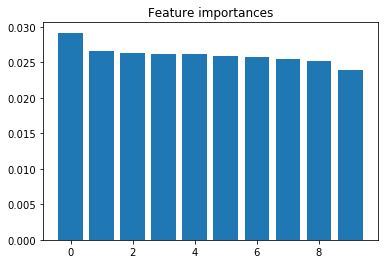

```
import pandas as pd
import numpy as np
import matplotlib.pyplot as plt

from sklearn.ensemble import RandomForestClassifier
from sklearn.ensemble import ExtraTreesClassifier
from sklearn.feature_selection import SelectFromModel

data = pd.read_csv("./LargeTrain.csv")
```


```
names = data.columns

X = np.array(data.ix[:,0:1804])
y = np.array(data.ix[:,1804:1805]).ravel()

forest = RandomForestClassifier(n_estimators=10)

forest = forest.fit(X, y)
importances = forest.feature_importances_

indices = np.argsort(importances)[::-1]

# Print the feature ranking
print("Feature ranking:")

for f in range(10):
    print("%d. feature %d (%f)" % (f + 1, indices[f], importances[indices[f]]))


# Plot the feature importances of the forest
plt.figure()
plt.title("Feature importances")

plt.bar(range(10), importances[indices[0:10]]) #show top 10 more influential features
plt.show()
```

    Feature ranking:
    1. feature 1286 (0.029169)
    2. feature 1159 (0.026552)
    3. feature 1294 (0.026309)
    4. feature 1290 (0.026191)
    5. feature 1281 (0.026112)
    6. feature 1291 (0.025884)
    7. feature 1346 (0.025710)
    8. feature 1332 (0.025463)
    9. feature 1160 (0.025207)
    10. feature 1162 (0.023905)





```
from sklearn.metrics import confusion_matrix
X_new = X[:,indices[0:10]]
forest_new = RandomForestClassifier(n_estimators=10)
forest_new = forest_new.fit(X_new, y)

y_pred = forest_new.predict(X_new)
cnf_matrix = confusion_matrix(y, y_pred)

print cnf_matrix
```

    [[1537    1    0    0    1    1    0    1    0]
     [   0 2478    0    0    0    0    0    0    0]
     [   0    0 2942    0    0    0    0    0    0]
     [   2    0    0  470    0    1    0    2    0]
     [   1    0    0    0   41    0    0    0    0]
     [   7    0    0    4    0  737    0    1    2]
     [   0    0    0    0    0    2  396    0    0]
     [   4    0    1    1    0    1    0 1220    1]
     [   4    1    0    0    0    2    1    0 1005]]


```

```
